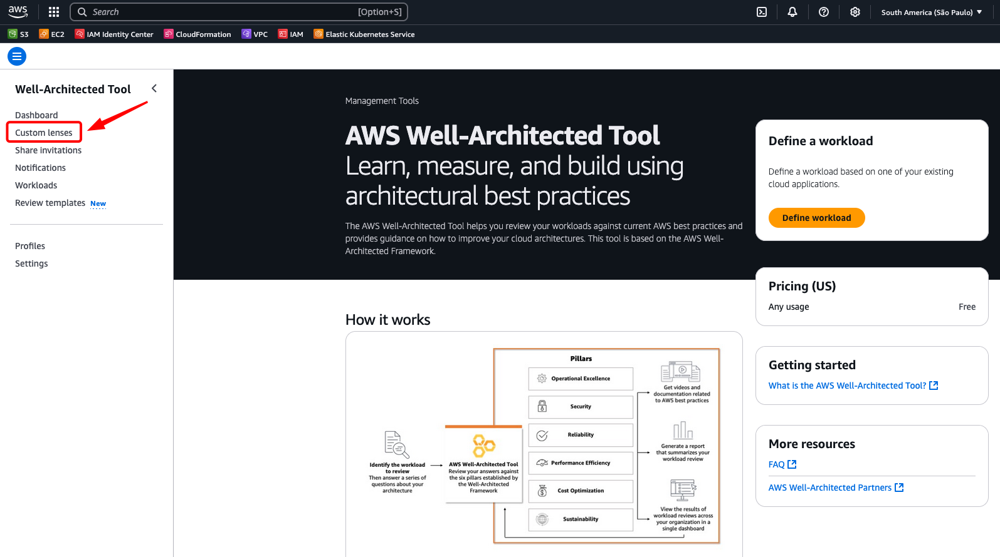
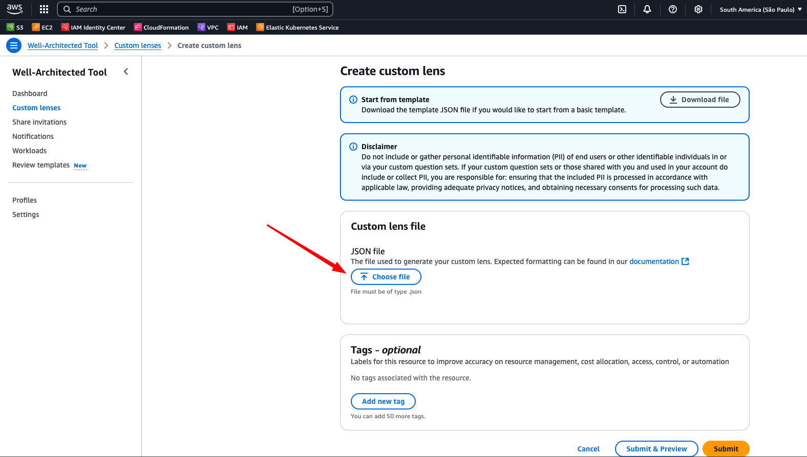
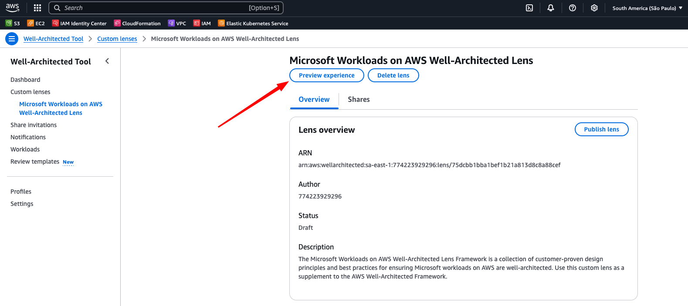
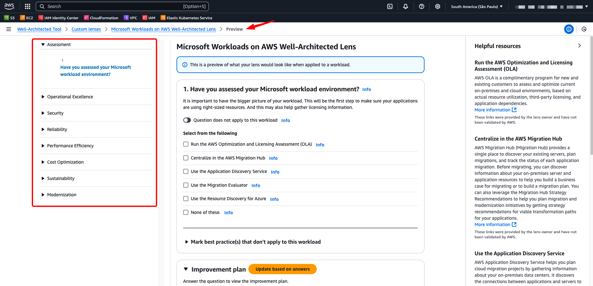

# AWS Well-Architected Microsoft on AWS Lens

The AWS Well-Architected for Microsoft Workloads Lens offers comprehensive guidance to make sure your migration and modernization strategies are designed in accordance with AWS best practices. It lets you bring your own best practices to complement the existing framework based on your industry, operational plans, and internal processes. Custom Lenses provide a consolidated view and a consistent way to measure and improve your workloads on AWS without relying on external spreadsheets or third-party systems.

Migrating to the cloud is just the start of the journey for many customers that continue to realize the ongoing benefits of the cloud through progressive modernization of their applications, data, and infrastructure. We've been helping customers modernize their Windows workloads on AWS for over 16 years and have the broadest portfolio of services, programs, and expertise to speed up the transformation of the applications that power your business.

## Overview

This custom lens provides a structured approach to evaluate Microsoft workloads running on AWS across 8 key pillars/phases:

1. **Assessment** - Evaluate your current Microsoft workload environment
2. **Operational Excellence** - Optimize operations and monitoring
3. **Security** - Implement security best practices for Microsoft workloads
4. **Reliability** - Ensure high availability and disaster recovery
5. **Performance Efficiency** - Optimize performance and resource utilization
6. **Cost Optimization** - Manage and optimize costs effectively
7. **Sustainability** - Implement sustainable practices
8. **Modernization** - Plan and execute modernization strategies

## Getting Started

### Prerequisites

- Access to AWS Well-Architected Tool
- AWS account with appropriate permissions
- Understanding of your Microsoft workload architecture

### How to Import the Custom Lens

1. **Download the Lens File**
   - Download the `microsoft-workloads-lens/microsoft-workloads-lens.json` file from the new repository: [sample-well-architected-custom-lens/microsoft-workloads-lens](https://github.com/aws-samples/sample-well-architected-custom-lens/blob/main/microsoft-workloads-lens/microsoft-workloads-lens.json)

2. **Access AWS Well-Architected Tool**
   - Navigate to the [AWS Well-Architected Tool](https://console.aws.amazon.com/wellarchitected/) in your AWS Console
   
   

3. **Import Custom Lens**
   - Go to "Custom lenses" in the left navigation
   - Click "Create custom lens"
   - Select "Import lens" 
   - Upload the `Microsoft_On_AWS_Lens.json` file
   - Review and confirm the import

   

4. **Preview the Lens**
   - After importing, you can use the "Preview Experience" to explore the lens
   - This allows you to see all questions, pillars, and guidance without creating a formal workload
   - Perfect for understanding the lens structure and content

   

For complete workload reviews and publishing the lens for broader use, refer to the [AWS Well-Architected Custom Lenses documentation](https://docs.aws.amazon.com/wellarchitected/latest/userguide/lenses-custom.html).

## How to Use This Lens

### Exploring the Lens Content
After importing the lens, use the **Preview Experience** to:
- Navigate through all 8 pillars systematically
- Review questions and understand the guidance provided
- Explore helpful resources and improvement plans for each question
- Get familiar with the lens structure before formal assessments

### Key Areas to Focus On

**Start with Assessment**: The Assessment pillar provides foundational questions about your current Microsoft workload environment.

**Review Question Structure**: Each question includes multiple choice options, helpful resources, and improvement plans.

### Next Steps
For conducting formal workload reviews, publishing the lens organization-wide, and advanced features, consult the [AWS Well-Architected Custom Lenses documentation](https://docs.aws.amazon.com/wellarchitected/latest/userguide/lenses-custom.html).

## Example Use Cases

### Scenario 1: .NET Application Migration
**Situation**: Migrating a legacy .NET Framework application to AWS

**Lens Application**:
- **Assessment**: Use OLA to understand current resource utilization
- **Modernization**: Evaluate containerization vs. lift-and-shift approaches
- **Cost Optimization**: Compare licensing models (BYOL vs. License Included)
- **Security**: Implement AWS security best practices for Windows workloads

### Scenario 2: SQL Server Database Modernization
**Situation**: Modernizing SQL Server databases on AWS

**Lens Application**:
- **Assessment**: Analyze current database performance and dependencies
- **Reliability**: Design for high availability with Multi-AZ deployments
- **Performance**: Optimize with Amazon RDS Performance Insights
- **Cost Optimization**: Right-size instances and storage

### Scenario 3: Microsoft Active Directory Integration
**Situation**: Integrating on-premises AD with AWS services

**Lens Application**:
- **Security**: Implement AWS Managed Microsoft AD or AD Connector
- **Operational Excellence**: Set up monitoring and logging
- **Reliability**: Design for cross-region redundancy
- **Performance**: Optimize network connectivity

## Lens Structure

This custom lens contains:
- **8 Pillars** covering the complete Microsoft workload lifecycle
- **50+ Questions** with detailed guidance
- **Multiple Choice Options** for each question
- **Helpful Resources** with links to AWS documentation
- **Improvement Plans** with actionable recommendations

## Best Practices

1. **Start with Assessment**: Always begin with the Assessment pillar to establish baseline understanding
2. **Involve Stakeholders**: Include application owners, security teams, and operations staff
3. **Document Decisions**: Keep track of architectural decisions and rationale
4. **Regular Reviews**: Schedule periodic reviews to ensure continuous improvement
5. **Leverage AWS Support**: Engage with AWS Solutions Architects for complex scenarios

## Contributing

* [Bruno Lopes](https://www.linkedin.com/in/blopesinfo/), Sr. Specialist SA, Containers
* [Carlos Felicio](https://www.linkedin.com/in/cafeliciobrz/), Sr. TAM (Partner)
* [Luciano Bernardes](https://www.linkedin.com/in/lucianobernardes/), US, Specialist Sr. SA
* [Vitor Euphrasio](https://www.linkedin.com/in/vitoreuphrasio/), Sr. Specialist SA, Infra Mig & Mod

## Resources

### AWS Documentation
* [AWS Well-Architected Framework](https://aws.amazon.com/architecture/well-architected/)
* [AWS Well-Architected Tool User Guide](https://docs.aws.amazon.com/wellarchitected/latest/userguide/)
* [Announcing AWS Well-Architected Custom Lenses](https://aws.amazon.com/blogs/aws/well-architected-custom-lenses-internal-best-practices/)

### Microsoft Workloads on AWS
* [Modernize Windows Workloads with AWS](https://aws.amazon.com/windows/modernization/)
* [Modernization pathways for a legacy .NET Framework monolithic application on AWS](https://aws.amazon.com/blogs/architecture/modernization-pathways-for-a-legacy-net-framework-monolithic-application-on-aws/)
* [AWS Optimization and Licensing Assessment](https://aws.amazon.com/windows/optimization-and-licensing-assessment/)

### Migration and Modernization
* [AWS Migration Hub](https://aws.amazon.com/migration-hub/)
* [AWS Application Discovery Service](https://aws.amazon.com/application-discovery/)
* [AWS Database Migration Service](https://aws.amazon.com/dms/)

## Support

For questions or issues with this custom lens:
1. Check the [AWS Well-Architected Tool documentation](https://docs.aws.amazon.com/wellarchitected/)
2. Contact your AWS Solutions Architect
3. Open an issue in this repository
