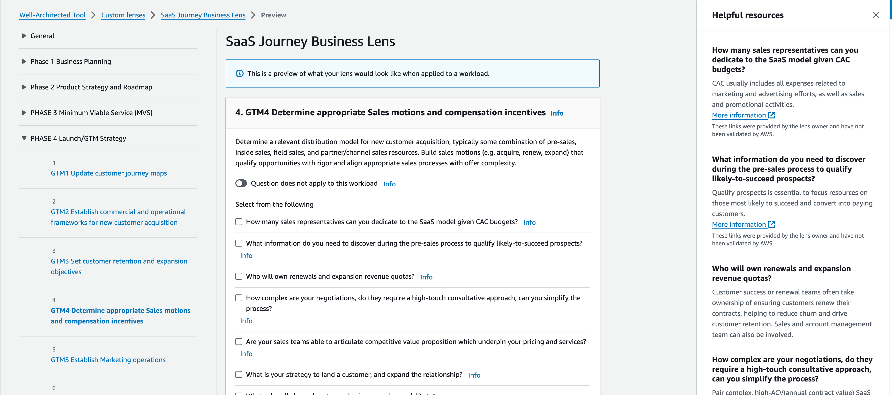

# SaaS Business Journey Custom Lens

## Getting started

This is a custom lens for [AWS Well-Architected Tool](https://aws.amazon.com/well-architected-tool/) to assess your SaaS business journey and implement both the strategic plans and product designs that will scale over time. This lens summarizes the AWS whitepaper - [SaaS Journey Framework: Building a New SaaS Solution on AWS](https://docs.aws.amazon.com/whitepapers/latest/saas-journey-framework/saas-journey-framework.html), addresses the challenges of the SaaS movements, and guides you to accelerate delivery of the SaaS solutions.

## Upload the JSON file

- Sign in to the AWS Management Console and open the [AWS Well-Architected Tool console](https://console.aws.amazon.com/wellarchitected)
- Choose **Custom lenses**
- Choose **Create custom lens**
- Upload the [saas_biz_custom_lens.json](./saas_biz_custom_lens.json) from this repo
- Choose **Submit & Preview** to preview the custom lens, or **Submit** to submit the custom lens without previewing.

For detailed instructions, see [Creating a custom lens for a workload in AWS WA Tool](https://docs.aws.amazon.com/wellarchitected/latest/userguide/lenses-create.html)

You should see similar view as below:

## Collaborate with your team
Walk through the questions with different functional roles:
- Phase 1 Business Planning : Executives, product managers and financial leaders. Technical and operational teams.
- Phase 2 Product Strategy and Roadmap Development : Product managers will be at the center of the effort. Technical and operational teams. Sales and marketing.
- Phase 3 Minimum Viable Service (MVS) : Product teams with product managers. Leadership team plays a key role to ensure all teams are delivering to the promise of the defined state. **As you define MVS, it will determine who should participate. E.g. If you are launching a new onboarding experience, the product, sales and marketing teams should be involved.**
- Phase 4 Launch / Go-To-Market : Leaders from sales, marketing, customer success and finance. Align with investor and board-level revenue expectations.

The framework is a dynamic working process that is not necessarily linear. While working on the product strategy, for example, you might revisit your business case and update it. Some activities might take place simultaneously.  

## Contributing
Please read our [contributing guidelines](./CONTRIBUTING.md)

## License
This library is licensed under the MIT-0 License. For more details, please take a look at the [LICENSE](./LICENSE) file.

## Disclaimer
This document is provided for informational purposes only. It represents the current product offerings and practices from Amazon Web Services (AWS) as of the date of issue of this document, which are subject to change without notice. Customers are responsible for making their own independent assessment of the information in this document and any use of AWS products or services, each of which is provided “as is” without warranty of any kind, whether express or implied. This document does not create any warranties, representations, contractual commitments, conditions, or assurances from AWS, its affiliates, suppliers, or licensors. The responsibilities and liabilities of AWS to its customers are controlled by AWS agreements, and this document is not part of, nor does it modify, any agreement between AWS and its customers.
